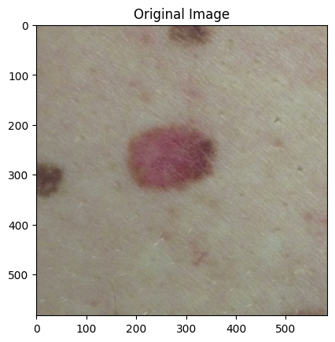
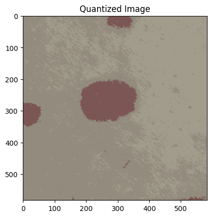
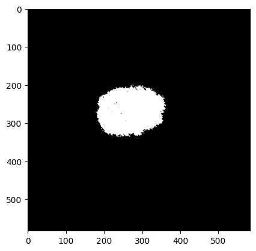
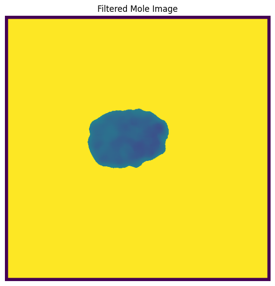

# Results and Explanation

This section demonstrates the outputs of the mole segmentation pipeline.  
The workflow progressively transforms the raw skin image into a clean and interpretable mole contour.

---

## 1. Original Image
Out of all the sample images available in the dataset (`mole_images/`),  
the file **`medium_risk_16.jpg`** was selected for demonstration in this run.  

This image is a dermoscopic/photographic skin image containing multiple moles.  
The mole of interest appears near the center of the image and serves as the baseline input  
for the segmentation pipeline.

---

## 2. Quantized Image (with K-Means Clustering)
The original image is processed using **K-Means clustering** for color quantization.  
The number of clusters is set to three, simplifying the image into three dominant colors:
- one representing the skin region,  
- one representing the mole region,  
- and one for background/shadows.  

This step reduces noise and enhances the visual separability of the mole.

---

## 3. Binary Mask (Darkest Cluster Extraction + DBSCAN)
From the quantized image, the **darkest cluster** is selected under the assumption that it corresponds to the mole.  
The pixel coordinates of this cluster are then processed using **DBSCAN** to eliminate isolated noise pixels and shadows.  
The result is a binary mask, where the mole is highlighted in white against a black background.

---

## 4. Filtered Mole Image (Contour Refinement)
The binary mask is applied to the original image to isolate the mole region.  
Additional filtering and contour smoothing are used to refine the borders, producing a smooth and medically interpretable mole contour.  
The background is replaced with a contrasting color (yellow in this case) for better visualization.

---

## Summary
- The pipeline effectively isolates the mole region from skin images.  
- Each step progressively improves clarity and reduces noise.  
- The final result is a segmented mole with smooth boundaries, ready for further analysis or classification.  

This demonstrates the potential of combining **K-Means clustering**, **DBSCAN**, and **contour refinement** for preprocessing dermatological images in support of mole classification tasks.

